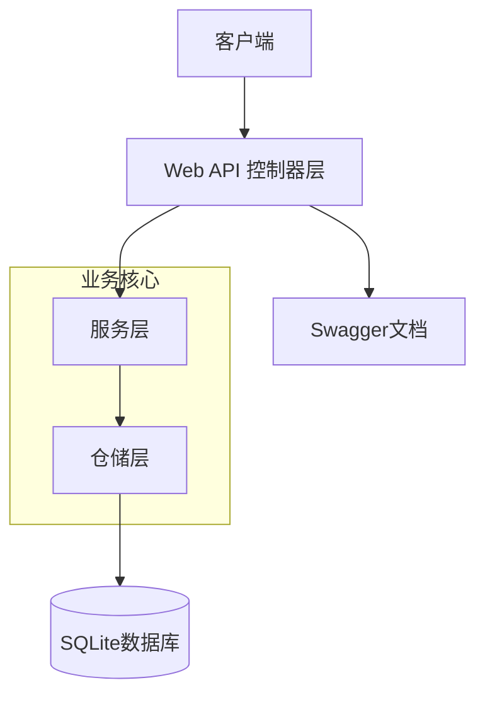

# 财务管理系统设计文档

## 1. 项目概述

本项目旨在开发一个基于.NET的Web API后端服务，为财务管理系统提供数据支持和业务逻辑处理。后端服务将采用RESTful API设计原则，使用SQLite作为数据库，并集成Swagger进行API文档管理和测试。

## 2. 系统架构

系统采用多层架构设计，清晰分离不同职责的组件，提高代码的可维护性和可扩展性。



### 架构层次说明

1. **Web API控制器层**：接收和响应HTTP请求，进行基本的请求验证和结果返回
2. **服务层**：实现核心业务逻辑，处理复杂业务规则和流程
3. **仓储层**：负责数据访问和持久化，与数据库交互
4. **数据库**：SQLite数据库，存储应用数据
5. **Swagger**：提供API文档和测试界面

## 3. 数据库设计

根据页面功能分析，系统需要设计以下主要实体和关系：

### 3.1 实体关系图

```mermaid
erDiagram
    User ||--o{ Project : "创建/管理"
    User ||--o{ Transaction : "记录"
    User ||--o{ Employee : "管理"
    User {
        int id PK
        string username
        string password_hash
        string real_name
        string role
        datetime created_at
        bool is_active
    }
    
    Project ||--o{ Transaction : "包含"
    Project ||--o{ Contract : "关联"
    Project {
        int id PK
        string name
        string code
        string description
        date start_date
        date end_date
        decimal budget
        string status
        int manager_id FK
        datetime created_at
    }
    
    IncomeCategory ||--o{ Transaction : "分类"
    IncomeCategory {
        int id PK
        string name
        string code
        bool is_active
        bool participate_accounting
        string description
        datetime created_at
    }
    
    ExpenseCategory ||--o{ Transaction : "分类"
    ExpenseCategory {
        int id PK
        string name
        string code
        bool is_active
        bool participate_accounting
        string description
        datetime created_at
    }
    
    Transaction {
        int id PK
        int project_id FK
        int account_id FK
        decimal amount
        string transaction_type
        int income_category_id FK
        int expense_category_id FK
        string description
        date transaction_date
        int created_by FK
        datetime created_at
        string attachment_path
        int tax_rate_id FK
    }
    
    Account ||--o{ Transaction : "记录"
    Account {
        int id PK
        string name
        string account_number
        string account_type
        decimal balance
        bool is_active
        datetime created_at
    }
    
    Contract {
        int id PK
        string contract_number
        string contract_type
        int project_id FK
        int customer_id_or_supplier_id FK
        date sign_date
        decimal total_amount
        string status
        date delivery_date
        string payment_terms
        datetime created_at
        int tax_rate_id FK
    }
    
    InvoiceType ||--o{ Invoice : "类型"
    InvoiceType {
        int id PK
        string name
        string code
        string description
        bool is_active
        datetime created_at
    }
    
    TaxRate ||--o{ Invoice : "税率"
    TaxRate ||--o{ Transaction : "税率"
    TaxRate ||--o{ Contract : "税率"
    TaxRate {
        int id PK
        decimal rate
        string description
        bool is_active
        datetime created_at
    }
    
    Invoice ||--o{ Transaction : "生成"
    Invoice ||--o{ Contract : "关联"
    Invoice {
        int id PK
        string invoice_number
        int contract_id FK
        int invoice_type_id FK
        decimal amount
        string invoice_type
        date invoice_date
        string status
        datetime created_at
        int tax_rate_id FK
        decimal tax_amount
        decimal amount_without_tax
    }
    
    Employee ||--o{ Salary : "获得"
    Employee ||--o{ Attendance : "记录"
    Employee ||--o{ Loan : "申请"
    Employee {
        int id PK
        string name
        string employee_number
        string position
        string department
        date hire_date
        decimal base_salary
        string status
        string contact_info
        datetime created_at
    }
    
    Salary {
        int id PK
        int employee_id FK
        date salary_month
        decimal basic_salary
        decimal bonus
        decimal deduction
        decimal actual_payment
        string payment_status
        date payment_date
        datetime created_at
    }
    
    Attendance {
        int id PK
        int employee_id FK
        date attendance_date
        string status
        time check_in
        time check_out
        decimal work_hours
        string remarks
    }
    
    Loan {
        int id PK
        int employee_id FK
        decimal loan_amount
        date loan_date
        string loan_purpose
        int repayment_months
        decimal monthly_payment
        string status
        datetime created_at
    }
    
    Customer {
        int id PK
        string name
        string contact_person
        string contact_info
        string address
        string tax_id
        decimal credit_limit
        datetime created_at
    }
    
    Supplier {
        int id PK
        string name
        string contact_person
        string contact_info
        string address
        string tax_id
        string bank_account
        datetime created_at
    }
    
    Customer ||--o{ Contract : "签订"
    Supplier ||--o{ Contract : "签订"
```



### 3.2 主要表结构设计

#### 3.2.1 用户表(User)
- id: 整型，主键
- username: 字符串，用户名
- password_hash: 字符串，密码哈希
- real_name: 字符串，真实姓名
- role: 字符串，角色
- created_at: 日期时间，创建时间
- is_active: 布尔值，是否激活

#### 3.2.2 项目表(Project)
- id: 整型，主键
- name: 字符串，项目名称
- code: 字符串，项目编码
- description: 字符串，项目描述
- start_date: 日期，开始日期
- end_date: 日期，结束日期
- budget: 小数，预算金额
- status: 字符串，项目状态
- manager_id: 整型，外键，项目经理ID
- created_at: 日期时间，创建时间

#### 3.2.3 收入科目表(IncomeCategory)
- id: 整型，主键
- name: 字符串，科目名称（如工程款、劳务收入、销售收入等）
- code: 字符串，科目编码
- is_active: 布尔值，是否激活
- participate_accounting: 布尔值，是否参与核算
- description: 字符串，描述
- created_at: 日期时间，创建时间

#### 3.2.4 支出科目表(ExpenseCategory)
- id: 整型，主键
- name: 字符串，科目名称（如员工工资、水费、电费等）
- code: 字符串，科目编码
- is_active: 布尔值，是否激活
- participate_accounting: 布尔值，是否参与核算
- description: 字符串，描述
- created_at: 日期时间，创建时间

#### 3.2.5 发票类型表(InvoiceType)
- id: 整型，主键
- name: 字符串，发票类型名称（如普通发票、增值税专用发票等）
- code: 字符串，类型编码
- description: 字符串，描述
- is_active: 布尔值，是否激活
- created_at: 日期时间，创建时间

#### 3.2.6 税率表(TaxRate)
- id: 整型，主键
- rate: 小数，税率值（如13%、9%、6%等）
- description: 字符串，描述
- is_active: 布尔值，是否激活
- created_at: 日期时间，创建时间

#### 3.2.7 交易表(Transaction)
- id: 整型，主键
- project_id: 整型，外键，关联项目
- account_id: 整型，外键，关联账户
- amount: 小数，交易金额
- transaction_type: 字符串，交易类型(收入/支出)
- income_category_id: 整型，外键，关联收入科目（当交易为收入时）
- expense_category_id: 整型，外键，关联支出科目（当交易为支出时）
- description: 字符串，交易描述
- transaction_date: 日期，交易日期
- created_by: 整型，外键，创建人
- created_at: 日期时间，创建时间
- attachment_path: 字符串，附件路径
- tax_rate_id: 整型，外键，关联税率

#### 3.2.8 账户表(Account)
- id: 整型，主键
- name: 字符串，账户名称
- account_number: 字符串，账号
- account_type: 字符串，账户类型
- balance: 小数，账户余额
- is_active: 布尔值，是否激活
- created_at: 日期时间，创建时间

#### 3.2.9 合同表(Contract)
- id: 整型，主键
- contract_number: 字符串，合同编号
- contract_type: 字符串，合同类型(销售/采购)
- project_id: 整型，外键，关联项目
- customer_id_or_supplier_id: 整型，外键，客户或供应商ID
- sign_date: 日期，签订日期
- total_amount: 小数，合同总金额
- status: 字符串，合同状态
- delivery_date: 日期，交付日期
- payment_terms: 字符串，支付条款
- created_at: 日期时间，创建时间
- tax_rate_id: 整型，外键，关联税率

#### 3.2.10 发票表(Invoice)
- id: 整型，主键
- invoice_number: 字符串，发票号码
- contract_id: 整型，外键，关联合同
- invoice_type_id: 整型，外键，关联发票类型
- amount: 小数，发票金额
- invoice_type: 字符串，发票类型(销售/采购)
- invoice_date: 日期，发票日期
- status: 字符串，发票状态
- created_at: 日期时间，创建时间
- tax_rate_id: 整型，外键，关联税率
- tax_amount: 小数，税额
- amount_without_tax: 小数，不含税金额

#### 3.2.11 员工表(Employee)
- id: 整型，主键
- name: 字符串，姓名
- employee_number: 字符串，员工编号
- position: 字符串，职位
- department: 字符串，部门
- hire_date: 日期，入职日期
- base_salary: 小数，基本工资
- status: 字符串，员工状态
- contact_info: 字符串，联系信息
- created_at: 日期时间，创建时间

#### 3.2.12 工资表(Salary)
- id: 整型，主键
- employee_id: 整型，外键，关联员工
- salary_month: 日期，工资月份
- basic_salary: 小数，基本工资
- bonus: 小数，奖金
- deduction: 小数，扣除金额
- actual_payment: 小数，实际支付
- payment_status: 字符串，支付状态
- payment_date: 日期，支付日期
- created_at: 日期时间，创建时间

#### 3.2.13 考勤表(Attendance)
- id: 整型，主键
- employee_id: 整型，外键，关联员工
- attendance_date: 日期，考勤日期
- status: 字符串，考勤状态
- check_in: 时间，签到时间
- check_out: 时间，签退时间
- work_hours: 小数，工作小时数
- remarks: 字符串，备注

#### 3.2.14 员工借款表(Loan)
- id: 整型，主键
- employee_id: 整型，外键，关联员工
- loan_amount: 小数，借款金额
- loan_date: 日期，借款日期
- loan_purpose: 字符串，借款目的
- repayment_months: 整型，还款月数
- monthly_payment: 小数，每月还款金额
- status: 字符串，借款状态
- created_at: 日期时间，创建时间

#### 3.2.15 客户表(Customer)
- id: 整型，主键
- name: 字符串，客户名称
- contact_person: 字符串，联系人
- contact_info: 字符串，联系方式
- address: 字符串，地址
- tax_id: 字符串，税号
- credit_limit: 小数，信用额度
- created_at: 日期时间，创建时间

#### 3.2.16 供应商表(Supplier)
- id: 整型，主键
- name: 字符串，供应商名称
- contact_person: 字符串，联系人
- contact_info: 字符串，联系方式
- address: 字符串，地址
- tax_id: 字符串，税号
- bank_account: 字符串，银行账户
- created_at: 日期时间，创建时间

## 4. API设计

系统API遵循RESTful设计原则，主要包括以下几个模块：

### 4.1 用户认证与授权

- POST /api/auth/login - 用户登录
- POST /api/auth/logout - 用户登出
- GET /api/auth/current-user - 获取当前用户信息

### 4.2 项目管理

- GET /api/projects - 获取项目列表
- GET /api/projects/{id} - 获取项目详情
- POST /api/projects - 创建新项目
- PUT /api/projects/{id} - 更新项目信息
- DELETE /api/projects/{id} - 删除项目
- GET /api/projects/{id}/statistics - 获取项目统计数据
- GET /api/projects/{id}/transactions - 获取项目交易记录

### 4.3 收入科目管理

- GET /api/income-categories - 获取收入科目列表
- GET /api/income-categories/{id} - 获取收入科目详情
- POST /api/income-categories - 创建新收入科目
- PUT /api/income-categories/{id} - 更新收入科目信息
- DELETE /api/income-categories/{id} - 删除收入科目

### 4.4 支出科目管理

- GET /api/expense-categories - 获取支出科目列表
- GET /api/expense-categories/{id} - 获取支出科目详情
- POST /api/expense-categories - 创建新支出科目
- PUT /api/expense-categories/{id} - 更新支出科目信息
- DELETE /api/expense-categories/{id} - 删除支出科目

### 4.5 发票类型管理

- GET /api/invoice-types - 获取发票类型列表
- GET /api/invoice-types/{id} - 获取发票类型详情
- POST /api/invoice-types - 创建新发票类型
- PUT /api/invoice-types/{id} - 更新发票类型信息
- DELETE /api/invoice-types/{id} - 删除发票类型

### 4.6 税率管理

- GET /api/tax-rates - 获取税率列表
- GET /api/tax-rates/{id} - 获取税率详情
- POST /api/tax-rates - 创建新税率
- PUT /api/tax-rates/{id} - 更新税率信息
- DELETE /api/tax-rates/{id} - 删除税率

### 4.7 财务交易

- GET /api/transactions - 获取交易列表
- GET /api/transactions/{id} - 获取交易详情
- POST /api/transactions - 创建新交易
- PUT /api/transactions/{id} - 更新交易信息
- DELETE /api/transactions/{id} - 删除交易
- GET /api/income-summary - 获取收入汇总
- GET /api/expense-summary - 获取支出汇总
- GET /api/transaction-report - 获取交易报告

### 4.8 合同管理

- GET /api/contracts - 获取合同列表
- GET /api/contracts/{id} - 获取合同详情
- POST /api/contracts - 创建新合同
- PUT /api/contracts/{id} - 更新合同信息
- DELETE /api/contracts/{id} - 删除合同
- GET /api/contracts/sales - 获取销售合同
- GET /api/contracts/purchase - 获取采购合同

### 4.9 发票管理

- GET /api/invoices - 获取发票列表
- GET /api/invoices/{id} - 获取发票详情
- POST /api/invoices - 创建新发票
- PUT /api/invoices/{id} - 更新发票信息
- DELETE /api/invoices/{id} - 删除发票
- GET /api/invoices/sales - 获取销售发票
- GET /api/invoices/purchase - 获取采购发票

### 4.10 员工管理

- GET /api/employees - 获取员工列表
- GET /api/employees/{id} - 获取员工详情
- POST /api/employees - 创建新员工
- PUT /api/employees/{id} - 更新员工信息
- DELETE /api/employees/{id} - 删除员工
- GET /api/employees/statistics - 获取员工统计数据

### 4.11 工资管理

- GET /api/salaries - 获取工资列表
- GET /api/salaries/{id} - 获取工资详情
- POST /api/salaries - 创建新工资记录
- PUT /api/salaries/{id} - 更新工资信息
- GET /api/salaries/employee/{employeeId} - 获取员工工资历史

### 4.12 考勤管理

- GET /api/attendance - 获取考勤列表
- GET /api/attendance/{id} - 获取考勤详情
- POST /api/attendance - 创建新考勤记录
- PUT /api/attendance/{id} - 更新考勤信息
- GET /api/attendance/employee/{employeeId} - 获取员工考勤历史
- GET /api/attendance/sheet - 获取考勤表

### 4.13 借款管理

- GET /api/loans - 获取借款列表
- GET /api/loans/{id} - 获取借款详情
- POST /api/loans - 创建新借款
- PUT /api/loans/{id} - 更新借款信息
- GET /api/loans/employee/{employeeId} - 获取员工借款历史

### 4.14 客户管理

- GET /api/customers - 获取客户列表
- GET /api/customers/{id} - 获取客户详情
- POST /api/customers - 创建新客户
- PUT /api/customers/{id} - 更新客户信息
- DELETE /api/customers/{id} - 删除客户

### 4.15 供应商管理

- GET /api/suppliers - 获取供应商列表
- GET /api/suppliers/{id} - 获取供应商详情
- POST /api/suppliers - 创建新供应商
- PUT /api/suppliers/{id} - 更新供应商信息
- DELETE /api/suppliers/{id} - 删除供应商

### 4.16 账户管理

- GET /api/accounts - 获取账户列表
- GET /api/accounts/{id} - 获取账户详情
- POST /api/accounts - 创建新账户
- PUT /api/accounts/{id} - 更新账户信息
- DELETE /api/accounts/{id} - 删除账户
- GET /api/accounts/statistics - 获取账户统计数据

### 4.17 报表生成

- GET /api/reports/profit - 获取利润报表
- GET /api/reports/period - 获取期间报表
- GET /api/reports/annual-summary - 获取年度汇总
- GET /api/reports/accounts-receivable - 获取应收账款报表
- GET /api/reports/accounts-payable - 获取应付账款报表

### 4.18 图表数据接口

- GET /api/charts/income-expense - 获取收支对比图表数据
- GET /api/charts/income-categories - 获取收入类别分布图表数据
- GET /api/charts/expense-categories - 获取支出类别分布图表数据
- GET /api/charts/monthly-trend - 获取月度收支趋势图表数据
- GET /api/charts/project-profit - 获取项目利润图表数据
- GET /api/charts/employee-performance - 获取员工绩效图表数据

## 5. Swagger配置

系统将集成Swagger UI，提供API文档和测试功能。主要配置如下：

```csharp
// 在Program.cs中添加Swagger服务
builder.Services.AddEndpointsApiExplorer();
builder.Services.AddSwaggerGen(c =>
{
    c.SwaggerDoc("v1", new OpenApiInfo 
    { 
        Title = "财务管理系统API", 
        Version = "v1",
        Description = "财务管理系统Web API服务",
        Contact = new OpenApiContact
        {
            Name = "系统管理员",
            Email = "admin@example.com"
        }
    });
    
    // 添加JWT认证配置
    c.AddSecurityDefinition("Bearer", new OpenApiSecurityScheme
    {
        Description = "JWT授权头使用Bearer方案, 例如: \"Authorization: Bearer {token}\"",
        Name = "Authorization",
        In = ParameterLocation.Header,
        Type = SecuritySchemeType.ApiKey,
        Scheme = "Bearer"
    });
    
    c.AddSecurityRequirement(new OpenApiSecurityRequirement
    {
        {
            new OpenApiSecurityScheme
            {
                Reference = new OpenApiReference
                {
                    Type = ReferenceType.SecurityScheme,
                    Id = "Bearer"
                }
            },
            new string[] {}
        }
    });
    
    // 包含XML注释
    var xmlFile = $"{Assembly.GetExecutingAssembly().GetName().Name}.xml";
    var xmlPath = Path.Combine(AppContext.BaseDirectory, xmlFile);
    c.IncludeXmlComments(xmlPath);
});

// 在应用中启用Swagger中间件
app.UseSwagger();
app.UseSwaggerUI(c =>
{
    c.SwaggerEndpoint("/swagger/v1/swagger.json", "财务管理系统API V1");
    c.RoutePrefix = string.Empty; // 设置Swagger UI为应用程序的根页面
});
```

## 6. 项目结构

```
FinanceManagement.Api/
├── Controllers/           # API控制器
├── Services/              # 业务服务
│   ├── Interfaces/        # 服务接口
│   └── Implementations/   # 服务实现
├── Models/                # 数据模型
│   ├── Entities/          # 数据库实体
│   ├── DTOs/              # 数据传输对象
│   └── ViewModels/        # 视图模型
├── Repositories/          # 数据访问
│   ├── Interfaces/        # 仓储接口
│   └── Implementations/   # 仓储实现
├── Data/                  # 数据上下文
│   └── ApplicationDbContext.cs
├── Configurations/        # 应用配置
├── Utilities/             # 工具类
├── Extensions/            # 扩展方法
├── Middlewares/           # 中间件
└── Program.cs             # 应用入口
```

## 7. 安全性考虑

1. **身份认证**：使用JWT进行API认证
2. **授权控制**：基于角色的访问控制(RBAC)
3. **数据验证**：使用数据注解和Fluent Validation进行请求验证
4. **异常处理**：全局异常处理中间件
5. **审计日志**：记录关键操作日志
6. **加密存储**：敏感数据加密存储

## 8. 部署注意事项

1. 确保SQLite数据库文件路径配置正确
2. 配置跨域(CORS)策略
3. 配置适当的日志级别
4. 在生产环境中使用HTTPS
5. 定期备份数据库文件